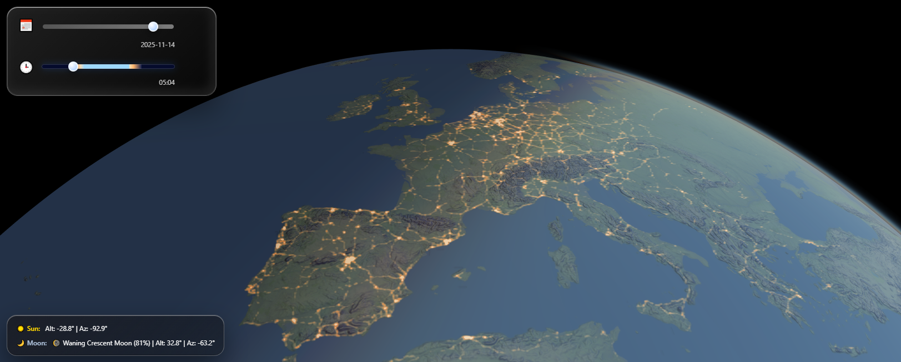

# Night Lights Globe

This project renders a MapLibre globe with a custom "urban heat" visualization that blends raster heatmaps, vector glow layers, and dynamic night lighting. Acontrol panel lets you scrub through the day of year and local time.
SunCalc-derived celestial data drives the lighting, day/night terminator.

## Features
- **Globe + terrain** based on MapLibre GL JS with Mapterhorn elevation tiles data.
- **Urban density heatmaps** for residential/commercial landuse, roads, and buildings, tuned through `scripts/stylePreset.js` and `scripts/nightLights.js`.
- **Vector glow layers** (motorways + arterial roads) that fade in with zoom and adjust brightness at night.
- **Daylight controls** with a day-of-year slider, a sunrise/sunset-coded time slider, and real-time sunrise/sunset readouts.
- **Celestial overlay** showing sun/moon positions and phases using SunCalc and custom `scripts/celestial.js` helpers.


## Running locally
1. Serve the folder over HTTP (MapLibre requires it). For example:
   ```bash
   # Windows PowerShell
   python -m http.server 8000
   ```
   or `npx serve .` if you have Node installed.
2. Open `http://localhost:8000/index.html` in a modern browser.
3. Use the sliders to scrub through daylight/times and observe the night lighting, celestial markers, and heatmap vectors updating in real time.


